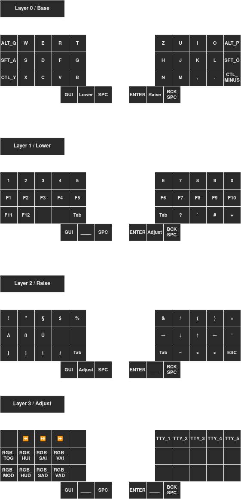

# The cotton-brain-keymap

A keymap for 3x5 split keyboards, suitable for gaming.

## The Idea behind this keymap

Among split keyboards the layout with 3 rows and 5 colums is a favourite for
minimalists. A common practice for such keyboards is to use homerow mods to
accomodate for a lack of keys. This unfortunately collides with most video game
keybindings as certain keys, such as those needed for movement and navigation,
need to be held down to fulfil their function.

The cotton brain keymap takes the usual mods and puts them along the respective
pinkie finger column, which also neatly resembles the way that W A S D keys are
situated in relation to the shift and ctrl keys. This allows for seamless
switching between video game usage and writing without compromising with
gaming layers that need extra key presses and take up time and concentration
when playing.

The one drawback to this is that you have to get used to a new orientation of
your mod tap keys which might be a bit cumbersome for people who are used to
homerow mods.

## The keymap in an example

The keymap was initially created for usage with ISO-DE in mind so adjust the
correlating keys to your liking if you are not an ISO-DE user (i might make an
ANSI example in the future).

Keep also in mind that this keymap was created for keyboard with 3 keys per
thumbcluster. If you only have 2 keys on your thumbcluster, turning the layer
keys into mod taps can work around this limitation neatly.



## Configuration in QMK / Adjusting for gameplay

For this to work in QMK, you have to do a few minor adjustments to the config.h .
If you are already familiar with homerow mods, this should seem familiar to you.

```
// ---- Mod tap settings ---

// Mod tap delay
#define TAPPING_TERM 120

// Avoid rollover mod presses
#define IGNORE_MOD_TAP_INTERRUPT

// Avoid mod double presses after holding
#define TAPPING_FORCE_HOLD
```

The mod tap delay is a very important factor as it dictates how much you have to
adjust your gameplay to the mod tap delay. I personally use a delay of 120ms but
i have also tested the default of 200ms which works perfectly fine with things
like rocket jumping that need precise timing. Adjust this for a good balance
between responsiveness in-game, and typing feel

The ingore mod tap interrupt and tapping force hold make the typing exerience
more fluent. This is not necessary but i prefer it this way.

I encourage you to read up on modifying the mod tap behaviour in qmk with their
documentation: https://github.com/qmk/qmk_firmware/blob/master/docs/tap_hold.md

## Why cotton brain?

1. My character / avatar i display my online persona with is a linen puppet.

2. The idea for this keymap came to be at 4AM right before sleeping which usually
is not the high point of cognitive functionality.

## Afterword

I made this keymap on the fly and entirely to my own preference. There may be
things missing, as i have even adjusted missing keys during the writing of this
documentation.

I may make an ANSI example of this keymap for easier translation into your
specific preferred keymap.

Implementation examples may come in the future, but not now as i have done the
entire Implementation and documentation of this in one hungover Sunday session
after going to bed at 5AM.

There may or may not be existing similar keymaps out there, i haven't checked.
I came up with this because gaming seemed a bit of the neglected child when it
came to small form factor keyboards. The usual mindset was to get an extra
keyboard just for gaming. I found this unnecessary as you can comfortably do both
if you have the right configuration.

If you have any suggestions or find issues, feel free to open up an issue so i
can address them.
